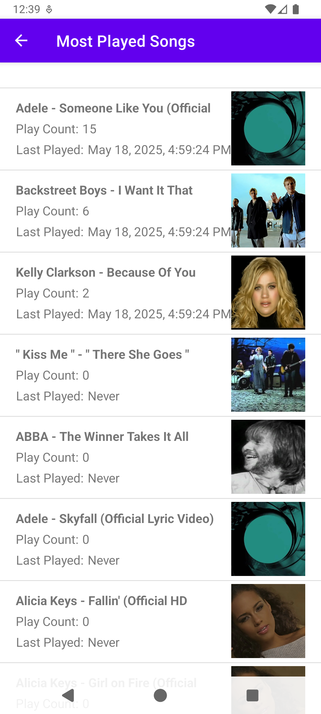

# SubStats

SubStats is an Android app for searching and browsing music from your Subsonic-compatible server.

## Features

- Search for songs, albums, and artists
- View detailed information for each item
- Fast and responsive UI

## Screenshots

|                | **Light**                                            | **Dark**                                           |
|----------------|------------------------------------------------------|----------------------------------------------------|
| **Statistics** |  |  |
| **List**       |              |              |
| **Detail**     |          |          |
| **Search**     |          |          |
| **Settings**   |      |      |

# Requirements

- Android 15 (API 35) or higher
- Subsonic-compatible server

# License

This project is licensed under the GNU Affero General Public License v3.0. See
the [LICENSE](LICENSE) file for details.